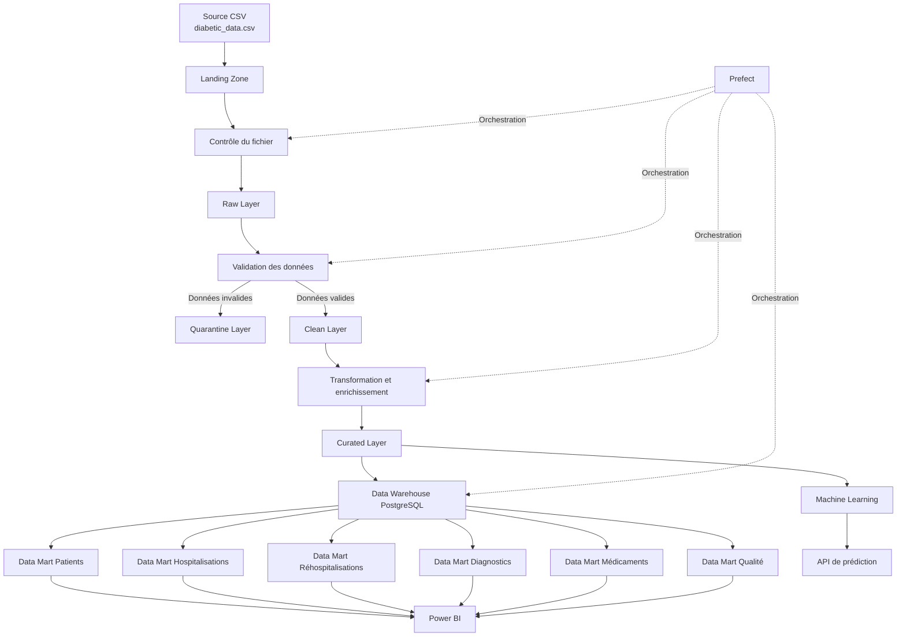

# Architecture Data Engineering de la plateforme de réhospitalisation

## 1. Objectif de l’architecture

Cette architecture a pour objectif d’organiser le traitement des données hospitalières depuis leur arrivée sous forme de fichiers CSV jusqu’à leur exploitation dans PostgreSQL, Power BI et, ultérieurement, dans un modèle de Machine Learning.

L’architecture doit permettre :

* de conserver les fichiers originaux ;
* d’assurer la traçabilité des traitements ;
* de contrôler la qualité des données ;
* de nettoyer et transformer les données ;
* de produire des données fiables pour l’analyse ;
* d’alimenter un Data Warehouse PostgreSQL ;
* de construire des Data Marts pour Power BI ;
* de préparer les données nécessaires au modèle de prédiction de la réhospitalisation.

L’ensemble de la plateforme est conçu pour pouvoir fonctionner localement ou sur un serveur interne du CHU, sans dépendre d’un cloud public.

---

# 2. Diagramme général



---

# 3. Flux général des données

Le flux principal de la plateforme est le suivant :

```text
Fichier CSV source
        ↓
Landing Zone
        ↓
Vérification du fichier
        ↓
Raw Layer
        ↓
Validation des données
        ↓
Clean Layer ou Quarantine Layer
        ↓
Transformation et enrichissement
        ↓
Curated Layer
        ↓
Data Warehouse PostgreSQL
        ↓
Data Marts
        ↓
Power BI
```

La Curated Layer pourra également alimenter le futur pipeline de Machine Learning.

---

# 4. Description des couches

## 4.1 Source de données

La source actuelle est le dataset :

```text
Diabetes 130-US Hospitals for Years 1999–2008
```

Les principaux fichiers utilisés sont :

```text
data/source/diabetic_data.csv
data/source/IDS_mapping.csv
```

Le fichier `diabetic_data.csv` contient les hospitalisations des patients.

Le fichier `IDS_mapping.csv` contient les descriptions associées à certains identifiants présents dans le dataset, par exemple :

* les types d’admission ;
* les sources d’admission ;
* les modes de sortie.

Dans une future utilisation au CHU Mohammed VI d’Oujda, ces fichiers publics pourront être remplacés par des extractions anonymisées provenant du système hospitalier.

---

## 4.2 Landing Zone

### Rôle

La Landing Zone est la zone d’arrivée des fichiers.

Les fichiers sont copiés dans cette zone avant tout traitement.

### Contenu

```text
data/landing/
```

### Règles

* conserver le fichier original ;
* ne modifier aucune valeur ;
* enregistrer la date d’arrivée ;
* vérifier le nom du fichier ;
* vérifier son extension ;
* calculer son empreinte numérique ;
* éviter l’importation répétée du même fichier.

### Exemple

```text
data/landing/2026-07-31_diabetic_data.csv
```

---

## 4.3 Raw Layer

### Rôle

La Raw Layer contient une copie exploitable des données brutes.

Les données restent proches du fichier original. Aucun nettoyage métier important n’est effectué dans cette couche.

### Contenu

```text
data/raw/
```

### Format choisi

```text
Parquet
```

### Exemple

```text
data/raw/diabetic_data_raw.parquet
```

### Raisons du choix de Parquet

* lecture plus rapide que CSV ;
* taille de stockage réduite ;
* conservation des types de données ;
* compatibilité avec Polars, DuckDB et PostgreSQL ;
* format adapté aux traitements analytiques.

---

## 4.4 Validation des données

### Rôle

La validation vérifie que les données respectent les règles techniques et métiers avant leur nettoyage.

### Contrôles techniques

* présence des colonnes obligatoires ;
* nombre de colonnes attendu ;
* types de données ;
* identifiants manquants ;
* doublons ;
* valeurs nulles ;
* catégories inconnues ;
* fichier vide ou corrompu.

### Contrôles métiers

* `time_in_hospital` doit être positif ;
* `num_medications` ne doit pas être négatif ;
* `number_diagnoses` doit être cohérent ;
* `age` doit appartenir aux tranches attendues ;
* `readmitted` doit appartenir à `<30`, `>30` ou `NO` ;
* les valeurs des médicaments doivent appartenir aux catégories autorisées.

### Résultat

Les données valides sont envoyées vers la Clean Layer.

Les données invalides sont envoyées vers la Quarantine Layer.

---

## 4.5 Quarantine Layer

### Rôle

La Quarantine Layer conserve les lignes qui ne respectent pas les règles de qualité.

### Contenu

```text
data/quarantine/
```

### Informations conservées

Chaque ligne rejetée doit contenir :

* les données originales ;
* la colonne concernée ;
* la valeur incorrecte ;
* la règle non respectée ;
* le motif du rejet ;
* la date du rejet ;
* le nom du fichier source.

### Exemple

```text
data/quarantine/rejected_rows.parquet
```

Cette couche évite de supprimer silencieusement les données incorrectes.

---

## 4.6 Clean Layer

### Rôle

La Clean Layer contient les données corrigées, standardisées et validées.

### Contenu

```text
data/clean/
```

### Traitements prévus

* remplacement de `?` par des valeurs nulles ;
* conversion des types ;
* suppression des doublons exacts ;
* normalisation des catégories ;
* traitement des valeurs manquantes ;
* nettoyage des codes diagnostics ;
* contrôle des valeurs numériques ;
* standardisation des noms de colonnes.

### Exemple

```text
data/clean/diabetic_data_clean.parquet
```

Les données de cette couche sont propres, mais ne contiennent pas encore toutes les variables analytiques finales.

---

## 4.7 Curated Layer

### Rôle

La Curated Layer contient les données finales, enrichies et prêtes pour :

* les analyses ;
* les KPIs ;
* PostgreSQL ;
* Power BI ;
* le Machine Learning.

### Contenu

```text
data/curated/
```

### Variables créées

Exemples de variables dérivées :

```text
readmitted_30_days
total_previous_visits
age_group
diagnosis_group
has_insulin
medication_change_count
patient_complexity_score
frequent_patient
```

### Exemples de règles

```text
readmitted_30_days = 1 si readmitted = "<30"
readmitted_30_days = 0 sinon
```

```text
total_previous_visits =
number_outpatient
+ number_emergency
+ number_inpatient
```

### Exemple de fichier

```text
data/curated/readmission_curated.parquet
```

---

# 5. Data Warehouse PostgreSQL

## 5.1 Rôle

PostgreSQL sera utilisé comme entrepôt central pour stocker les données structurées et permettre leur exploitation par Power BI.

Le modèle décisionnel suivra une architecture en étoile.

## 5.2 Dimensions principales

```text
dim_patient
dim_admission
dim_diagnosis
dim_medication
dim_payer
```

## 5.3 Tables de faits

```text
fact_hospitalization
fact_readmission
```

## 5.4 Principe

Les dimensions contiennent les informations descriptives.

Les tables de faits contiennent les mesures et les événements d’hospitalisation.

Exemple :

```text
dim_patient
     |
dim_admission
     |
dim_diagnosis
     |
fact_hospitalization
     |
fact_readmission
```

---

# 6. Data Marts

Les Data Marts sont des tables ou vues spécialisées préparées pour les besoins de Power BI.

## 6.1 Data Mart Patients

Il contiendra notamment :

* nombre de patients ;
* répartition par sexe ;
* répartition par âge ;
* répartition par race ;
* profils de patients les plus fréquents.

## 6.2 Data Mart Hospitalisations

Il contiendra notamment :

* nombre d’hospitalisations ;
* durée moyenne du séjour ;
* admissions par type ;
* admissions par source ;
* répartition des modes de sortie.

## 6.3 Data Mart Réhospitalisations

Il contiendra notamment :

* taux global de réhospitalisation ;
* taux de retour en moins de 30 jours ;
* taux de retour après 30 jours ;
* taux par âge ;
* taux par diagnostic ;
* taux par type d’admission.

## 6.4 Data Mart Diagnostics

Il contiendra notamment :

* diagnostics principaux ;
* groupes de diagnostics ;
* nombre de séjours par diagnostic ;
* taux de réhospitalisation par diagnostic.

## 6.5 Data Mart Médicaments

Il contiendra notamment :

* médicaments prescrits ;
* utilisation de l’insuline ;
* changements de traitement ;
* réhospitalisation selon les traitements.

## 6.6 Data Mart Qualité

Il contiendra notamment :

* nombre de lignes reçues ;
* nombre de lignes valides ;
* nombre de lignes rejetées ;
* nombre de doublons ;
* taux de valeurs manquantes ;
* résultats des contrôles qualité.

---

# 7. Technologies retenues

## Python

Python sera utilisé pour développer les scripts d’ingestion, de validation, de transformation et de chargement.

## Polars

Polars sera utilisé pour lire et transformer rapidement les fichiers CSV et Parquet.

## Parquet

Parquet sera utilisé pour stocker les données dans les couches Raw, Clean, Curated et Quarantine.

## PostgreSQL

PostgreSQL sera utilisé pour construire le Data Warehouse et les Data Marts.

## SQLAlchemy

SQLAlchemy permettra à Python de communiquer avec PostgreSQL.

## DuckDB

DuckDB pourra être utilisé pour effectuer des analyses SQL directement sur les fichiers Parquet.

## Prefect

Prefect orchestrera ultérieurement les différentes tâches :

* ingestion ;
* validation ;
* nettoyage ;
* transformation ;
* chargement PostgreSQL ;
* génération des rapports.

## Power BI

Power BI sera connecté aux Data Marts PostgreSQL pour créer les tableaux de bord.

## Docker

Docker et Docker Compose permettront de lancer PostgreSQL et les différents services de manière reproductible.

## Git et GitHub

Git et GitHub seront utilisés pour :

* versionner le code ;
* suivre les modifications ;
* conserver la documentation ;
* faciliter la collaboration.

---

# 8. Traçabilité

Chaque exécution du pipeline devra produire des informations de suivi :

* nom du fichier traité ;
* empreinte du fichier ;
* date et heure de traitement ;
* nombre de lignes reçues ;
* nombre de lignes acceptées ;
* nombre de lignes rejetées ;
* durée du traitement ;
* statut de l’exécution ;
* message d’erreur éventuel.

Les fichiers de logs seront placés dans :

```text
logs/
```

---

# 9. Sécurité et confidentialité

Dans le contexte hospitalier, l’architecture devra respecter les principes suivants :

* fonctionnement sur une infrastructure interne ;
* absence de stockage dans un cloud public ;
* anonymisation ou pseudonymisation des patients ;
* restriction des accès à la base de données ;
* absence de données personnelles dans les logs ;
* sauvegarde contrôlée des données ;
* séparation entre les environnements de développement et de production.

Le dataset public actuel ne contient pas directement les données réelles du CHU. Il sert à construire et tester l’architecture de la plateforme.

---

# 10. Gestion des erreurs

Une erreur dans une étape ne doit pas entraîner la perte du fichier original.

Le comportement prévu est :

```text
Erreur fichier
    → arrêt de l’ingestion
    → enregistrement dans les logs

Erreur sur certaines lignes
    → lignes invalides vers Quarantine
    → lignes valides poursuivent le pipeline

Erreur PostgreSQL
    → conservation des fichiers Parquet
    → nouvelle tentative de chargement

Erreur Power BI
    → conservation des données dans PostgreSQL
    → rafraîchissement ultérieur
```

---

# 11. Architecture finale retenue

```text
Sources CSV
    ↓
Landing Zone
    ↓
Contrôle et traçabilité des fichiers
    ↓
Raw Layer en Parquet
    ↓
Validation technique et métier
    ├── Données invalides → Quarantine Layer
    └── Données valides → Clean Layer
                              ↓
                    Transformation et enrichissement
                              ↓
                         Curated Layer
                         ├── Data Warehouse PostgreSQL
                         │          ↓
                         │      Data Marts
                         │          ↓
                         │       Power BI
                         │
                         └── Machine Learning
                                    ↓
                              API de prédiction
```

---

# 12. Conclusion

L’architecture retenue sépare clairement les données selon leur niveau de traitement.

La Landing Zone assure la conservation des fichiers reçus.

La Raw Layer conserve les données brutes dans un format performant.

La Clean Layer contient les données nettoyées et validées.

La Curated Layer contient les données enrichies et prêtes pour l’analyse.

PostgreSQL centralise les données décisionnelles.

Les Data Marts facilitent la création des tableaux de bord Power BI.

Cette architecture est simple, évolutive, traçable et adaptée à une future utilisation sur l’infrastructure interne du CHU Mohammed VI d’Oujda.
